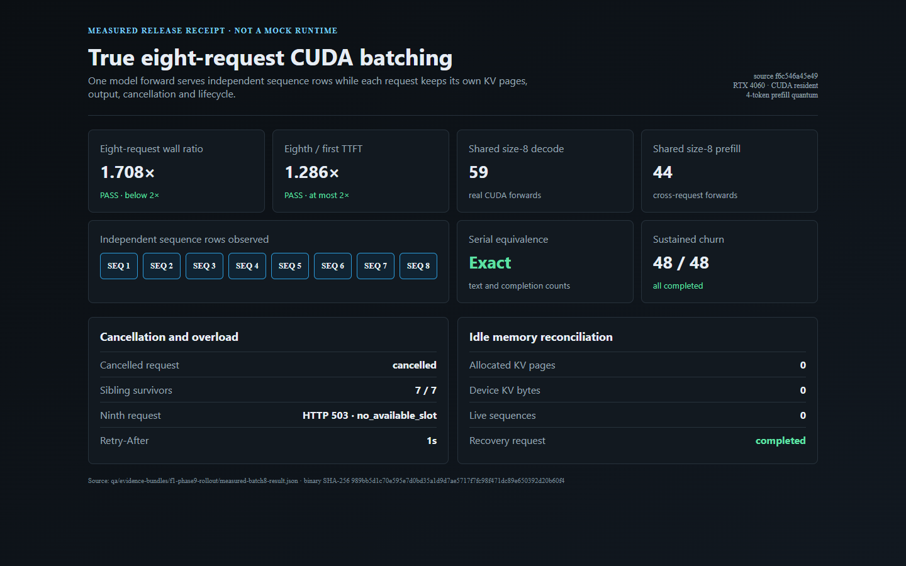
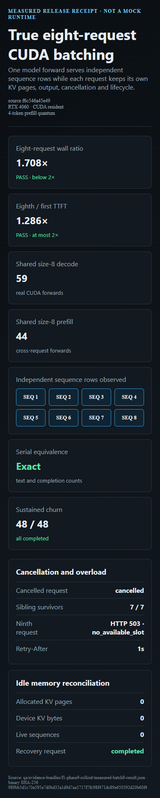
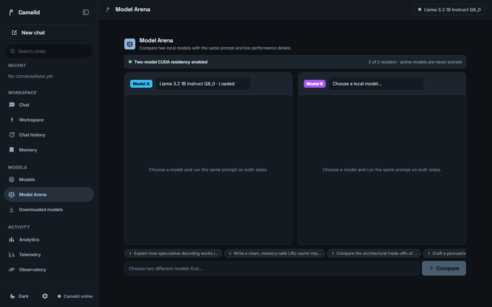
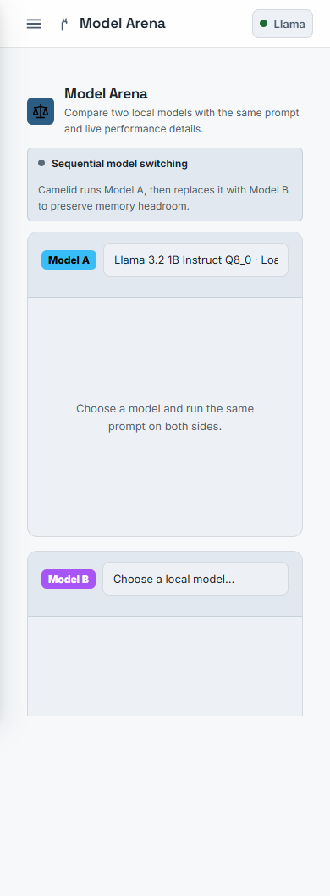
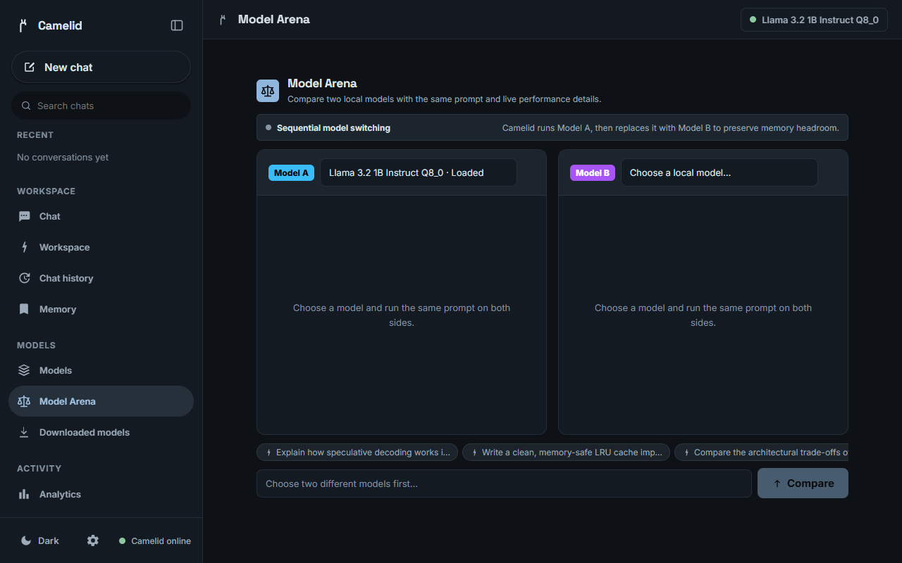
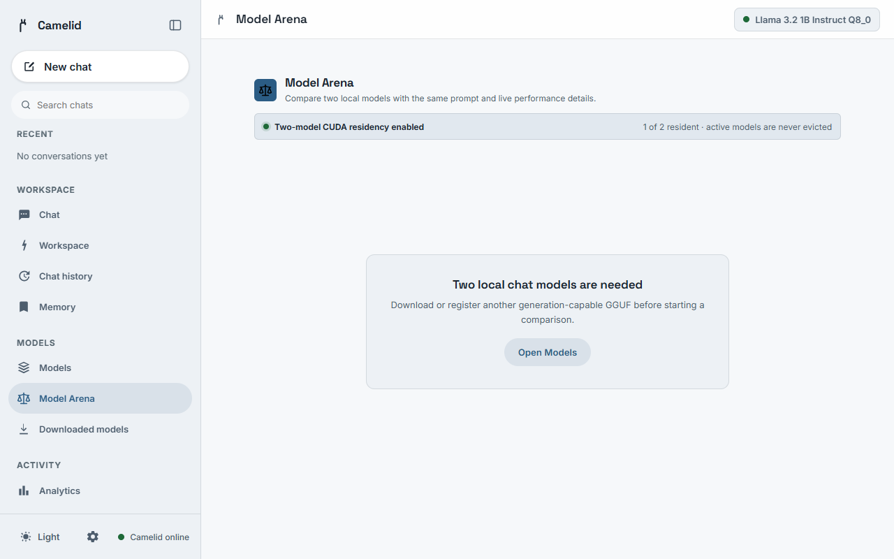
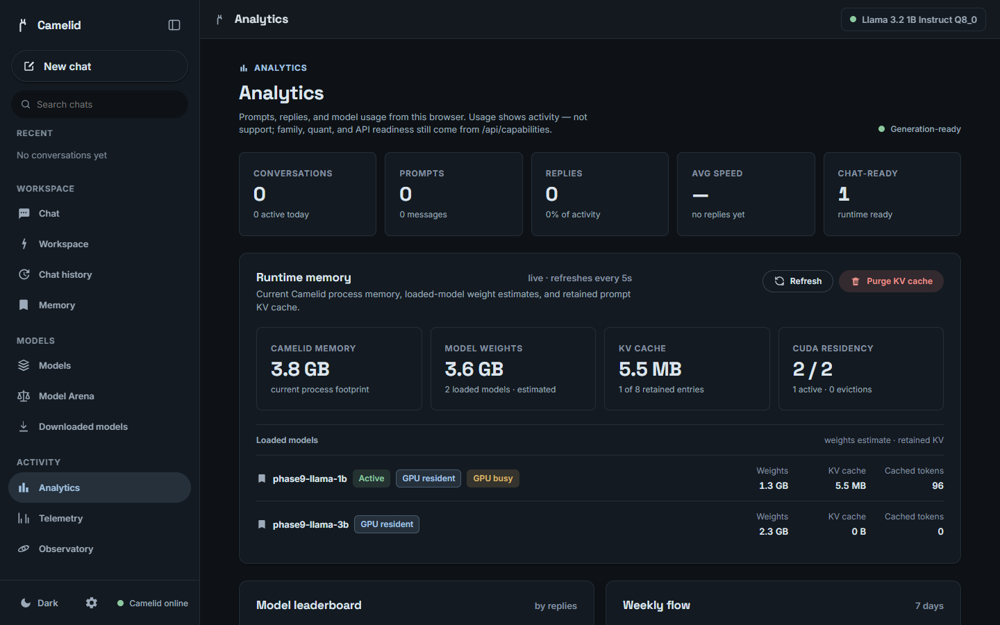
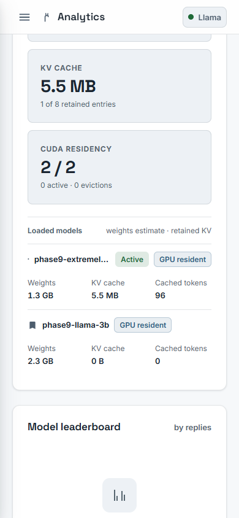
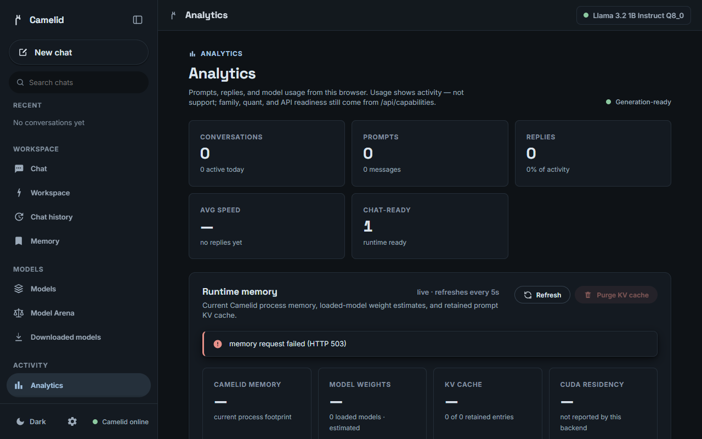

# F1 Phase 9 rollout visual evidence

These screenshots are generated by `frontend/scripts/arena-residency-browser-smoke.mjs` against the real Vite application with deterministic intercepted API responses.

The matrix covers:

- CUDA resident capacity two on desktop dark mode.
- Default capacity one on mobile light mode.
- An older backend that omits the arena health field.
- The one-model Arena empty state.
- Active GPU residency in Runtime Memory.
- A long model identity on mobile.
- Runtime-memory HTTP failure handling.

The smoke also asserts no horizontal overflow, no overlapping Arena panes, and the live residency status ARIA contract before writing each screenshot.

These images demonstrate frontend behavior and API presentation only. They are not GPU performance or model-support evidence. Physical CUDA mechanism evidence remains in the locally generated Phase 8 receipt and the PR's validation summary.

## Gallery

### Measured eight-request proof

### Capacity two, desktop dark

### Default one, mobile light

### Older backend without arena health

### One-model empty state

### Active CUDA model, desktop dark

### Long model identity, mobile light

### Runtime-memory failure

